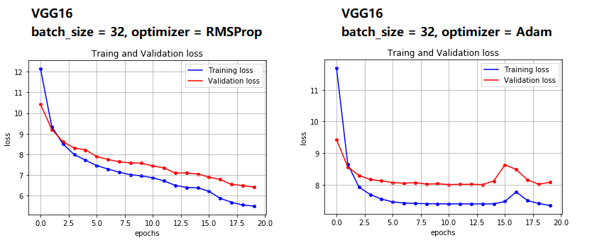
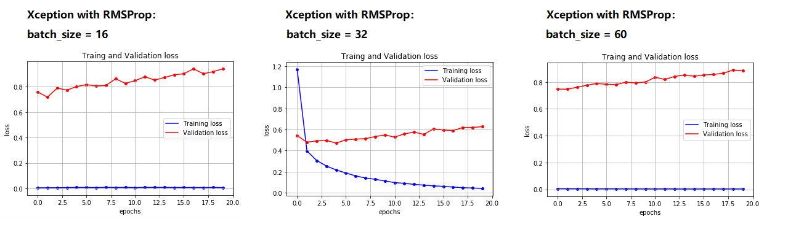

# Dog Breed Detector and Classify Project

This project is capstone project for DSND. It will using the Dog species images to train a Doggie classifer, make an interestig application along with human face detection, and finally deploy the model inference online.

Dog species identification is a hard tasl even for human. So the major goal to this project are:
1. explore the data, including data/outliers preprocess;
2. build the CNN model to tackle this probelm;
3. using training strategies for a higher model performance;
4. deploy a ML web application online for inference. 

In order to train and evaluate the performance of the CNN model, this project will use the RMSProp optimizer, categorical_crossentropy as loss function, and accuracy as the metrices.
It is reasonable to categorical cross entropy to measure the loss because our objects could be more than 100 classes and it's a classification problem. So accuracy is straitforward to evaluathe the classify tasks.

## Project Analysis

The data set is open-sourced and it will using keras.preprocessing to handle the preprocessing part. Bacause one of the tasks of this project is to detect human faces in the images so we should be aware of human faces in the dog set.
Before training model we should have a feel how the face detetor performed on dog data set: (opencv facial detector, haarcascades)
1. 99.0% human faces successfully deteted using on human faces images when using human face detector;
2. 12.0% human faces mistakenly detected using on dog images set when using human face detector
and how the dog detector worked on both data set (Resnet50, pretrained on ImageNet):
1. 1.0% dog misclassified calssified on human faces data set;
2. 100.0% dog identified on dag image set.

虽然本例数据异常的情况发生很少，但是对于其他数据驱动的工程通常数据预处理需要对异常数据进行处理，常见的异常数据包括错误标注，缺失，等等，通常处理方法可以包含 1.删除含有异常值的记录； 2.将异常值视为缺失值，交给缺失值处理方法来处理； 3.用平均值来修正； 4.不处理

## Methodology

CNN have been introduced for multi-image-classify. In this project, it will explore the model in three steps:
1. build self-defined CNN from scratch;
2. transfer learning using pre-trained VGG16 as feature extractor + defined model;
3. using another models as feature extractor; (VGG19, Resnet-50, Inception, Xception)

## Model performance

To train the model, the RMSProp optimizer are employed, also categorical_crossentropy as loss and measure the accuracy of predictions on validation set. 

categorical_crossentropy损失函数，交叉熵是用来评估当前训练得到的概率分布与真实分布的差异情况。它刻画的是实际输出（概率）与期望输出（概率）的距离，也就是交叉熵的值越小，两个概率分布就越接近。训练网络所使用的m个类别的标签值是经过矢量化后的m维向量，其中向量一个索引为1，其余索引为0，对应一个类别 (like one-hot encoding)。这样类别被向量化，和神经网络训练出来的m个概率值对应，概率值最大的那个输出所对应的向量，其所代表的标签即为所对应的。
标签向量化：keras中可使用to_categorical对标签值进行向量化。

准确率(accuracy)： 对于给定的测试数据集，分类器正确分类的样本数与总样本数之比. 也就是损失函数是0-1损失时测试数据集上的准确率. accuracy是正确预测的样本数占总预测样本数的比值，它不考虑预测的样本是正例还是负例。 
Accuracy = (预测正确的样本数)/(总样本数)=(TP+TN)/(TP+TN+FP+FN)

因为本任务属于**多分类**问题 (numOfClass = 133)，所以评价标准和损失函数如是选择。

Here is the test accuracy after training:
1. training from scratch: 1.1962%；
2. transfer learning with VGG16: 43.7799%;
3. transfer learning with Xception: 86.9617%.

Also another observation is the training speed is much faster when using transfer learning.
After trained model, the inference is deployed through Flask.

对于模型调优，本例尝试了:

1. **使用不同的优化算子**： Adam, RMSProp.

从此可以看出，Adam算法在收敛速度上面占优势，但是Train和Validation loss分别收敛至7.5和8左右； 使用RMSProp收敛速度较慢，即使30次epochs之后依然loss在下降。在第20次loss在测试集上降至约6.5左右，在训练集上降至5.5.

2. **Batch size**;

此例对照试验采取不同的batch size对Xception模型的训练影响.

3. **不同模型**： VGG16, VGG1, Xception.

此例测试不同模型的能力，使用batch size = 32， RMSProp的优化算子。
ResNet-50 收敛速度最快，但是validation loss居于大概0.6并出现过拟合状态（training loss下降但同时validation loss升高）； InceptionV3收敛速度略慢，但validation loss在20次epochs后达到0.9； VGG19是收敛速度最慢的模型，在20次epochs中不能收敛至全局最小； Xception则在validation loss和收敛速度上较其他模型都具有优势，也就是接下来web deployment的pick。

综上实验，网络部署将使用Xception模型 （RMSProp, Batch size = 32, epochs = 20）.

## Conclusions & Discussion
1. data pipeline make the data ready for training. This case the preprocessing are readily avaiable using Keras, but for many real-problem, preprocessing using data pipeline is enssential. Collecting data, remove outliers image data, and normalize. Somethimes when the data is limited image augmentation technique would also be introduced.
2. transfer learning could help with model to converge faster, and also provided more accuracy results. deep learning needs to be in a scene with a large amount of labeled data in order to make better use of its effects. However, in many practical scenarios, we do not have enough labeled data; the universal model can solve most public problems, but it is difficult to meet the specific needs of individual models. Therefore, it is necessary to transform and adapt the general model to meet personalized needs; transfer knowledge from similar fields through transfer learning; model training for some massive data requires a lot of computing power. Generally, small and medium-sized enterprises or individuals Can't afford to burn this money, so they need to be able to use these data and models.
3. model could be benefited from advanced model (deeper structure). In theory, deeper CNN has stronger capacity of extracting advance or complex features, but also it could also be suffering from training difficulties such as gradient vanishing or overfitting. 

讨论：
There are 133 total dog categories and 8351 total dog images. 通过抽样观察数据集下的每一个品类的图片，可以确定数据集大体是是均衡的。 在训练中，意外的是模型出现了过拟合的情况，training loss一直在下降并处于很小的值，但是validation loss却出现缓慢上升。这可能是因为Resnet-50模型表征特征的能力强大（其大量的使用了特征复用的block）而数据量相对小的结果。

为了解决此类问题，可以适量的增大现有数据集（数据增强技术，image augmentation）。并且，由于Xception模型参数量大，导致在网络部署的过程中inference的速度较为缓慢。所以为使模型更快速推断，更高效轻便的、的网络（Mobilenet， ShuffleNet）可能是潜在选择，或者是运用模型压缩或枝剪技术。

## What's in it
- Here are all the files in this project:
<pre>
app                                 -> the flask app dir
bottleneck_features                 -> the bottleneck features dir
dog_breed.html                      -> the html export from notebook
dog_breed.ipynb                     -> the main notebook
dog_images                          -> the dataset dir
extract_bottleneck_features.py      -> some useful functions
haarcascades                        -> haarcascades dir
images                              -> test images
README.md                           -> readme file
</pre>

## How to run it
- My Python version:
<pre>
Python 3.6.6
</pre>

- This is my pypi list:
<pre>
Package                 Version
----------------------- ---------
Flask                   1.1.2
h5py                    2.8.0
Keras                   2.3.1
matplotlib              3.1.3
mistune                 0.8.4
nltk                    3.4.5
numpy                   1.18.1
opencv-python           4.2.0.34
Pillow                  7.1.2
pip                     20.0.2
scikit-learn            0.22
scipy                   1.4.1
tensorflow-gpu          1.13.1
tqdm                    4.46.0
</pre>

- To run web application after installed all the requirements pkgs, lets run the deployed Flask app by running:
<pre>
1. cmd line: cd app
2. cmd line: python run.py
3. Running on http://127.0.0.1:3001/
</pre>

- So you are welcomed to upload your image, and have fun!

Reference and Thanks:
1. https://github.com/kylechenoO/Dog_Breed;
2. https://towardsdatascience.com/building-a-convolutional-neural-network-cnn-in-keras-329fbbadc5f5
2. https://www.freecodecamp.org/news/how-to-build-a-web-application-using-flask-and-deploy-it-to-the-cloud-3551c985e492/

